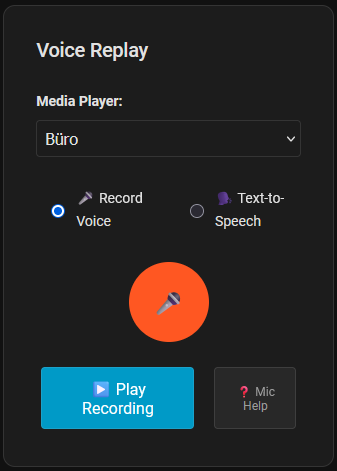

# Voice Replay Card

[](https://github.com/chechirecat/hass-voice-replay-card/releases)
[](https://github.com/chechirecat/hass-voice-replay-card/actions)
[](https://hacs.xyz/docs/faq/custom_repositories)
[](LICENSE)

🎨 A beautiful Lovelace card for the Voice Replay Home Assistant integration.

## Screenshot



## Installation

[](https://my.home-assistant.io/redirect/hacs_repository/?owner=chechirecat&repository=hass-voice-replay-card&category=plugin)

### HACS (Recommended)

1. **Install via HACS Button:**

   - Click the badge above, or
   - Manually add this repository URL to HACS: `https://github.com/chechirecat/hass-voice-replay-card`

2. **Download the card:**

   - Open HACS → Frontend
   - Search for "Voice Replay Card"
   - Click "Download"

3. **Restart and clear cache:**

   - Restart Home Assistant
   - Clear browser cache (Ctrl+Shift+R)

### Manual Installation

[](https://github.com/chechirecat/hass-voice-replay-card/releases/latest)

1. **Download the file:**

   - Click the "Download Latest Release" button above
   - Download `voice-replay-card.js`

2. **Copy to Home Assistant:**

   - Place the file in `<config>/www/voice-replay-card.js`

3. **Add resource:**

   - Go to Settings → Dashboards → Resources  
   - Add Resource: `/local/voice-replay-card.js` (JavaScript Module)

4. **Restart and clear cache:**

   - Restart Home Assistant
   - Clear browser cache (Ctrl+Shift+R)

## Prerequisites

⚠️ **Required Integration:** This card requires the Voice Replay integration to be installed first.

[](https://my.home-assistant.io/redirect/hacs_repository/?owner=chechirecat&repository=hass-voice-replay&category=integration)

**[Install Voice Replay Integration →](https://github.com/chechirecat/hass-voice-replay)**

## Features

🎤 **Voice Recording** - Record audio directly from your browser  
🗣️ **Text-to-Speech** - Generate speech using Home Assistant's TTS services  
📱 **Mobile Optimized** - Touch-friendly interface with large buttons  
🎨 **Theme Integration** - Automatically matches your Home Assistant theme  
🏠 **Multi-Room Audio** - Play on any media player in your home  
⚙️ **Configurable** - Customize appearance and default settings  

## Quick Start

1. **Add to your dashboard:**
   - Edit dashboard → Add Card → Search "Voice Replay Card"

2. **Basic card config:**
   ```yaml
   type: custom:voice-replay-card
   title: Voice Replay
   ```

3. **Start using:**
   - Record voice messages with the microphone button 🎤
   - Or type text for text-to-speech 🗣️
   - Select media players and enjoy! 🎵

## Usage

### Add to Dashboard

1. Edit your dashboard
2. Add a new card
3. Select "Custom: Voice Replay Card" (or search for "voice replay")
4. Configure the card options

### Basic Configuration

```yaml
type: custom:voice-replay-card
title: Voice Replay
```

### Advanced Configuration

```yaml
type: custom:voice-replay-card
title: My Voice Messages
show_header: true
```

## Configuration Options

| Option | Type | Default | Description |
|--------|------|---------|-------------|
| `type` | string | **Required** | Must be `custom:voice-replay-card` |
| `title` | string | `Voice Replay` | Card title |
| `show_header` | boolean | `true` | Show/hide the card header |

## How to Use

### Recording Voice Messages
1. Select a media player from the dropdown
2. Make sure "Record Voice" mode is selected
3. Click the red microphone button to start recording
4. Click the stop button (⏹️) when finished
5. Click "Play Recording" to play on your selected media player

### Text-to-Speech
1. Select a media player from the dropdown
2. Switch to "Text-to-Speech" mode
3. Type your message in the text area
4. Click "Generate & Play Speech"

## Troubleshooting

### Card doesn't appear
- Make sure the resource is added correctly
- Clear browser cache (Ctrl+Shift+R)
- Check browser console for errors

### "Failed to load media players"
- Ensure the Voice Replay integration is installed and configured
- Check that Home Assistant can access the integration's API endpoints

### Microphone not working
- Grant microphone permissions in your browser
- HTTPS is required for microphone access
- Check browser compatibility (modern browsers only)

### TTS not working
- Ensure you have TTS configured in Home Assistant
- Check the integration logs for TTS-related errors

## Browser Compatibility

- ✅ Chrome/Edge 66+
- ✅ Firefox 60+
- ✅ Safari 14.1+
- ❌ Internet Explorer (not supported)

## Development

### No Build Process Required

This card is implemented as pure JavaScript with no build dependencies! Simply edit `voice-replay-card.js` directly.

### Testing

1. Copy `voice-replay-card.js` to your Home Assistant's `<config>/www/` directory
2. Add it as a resource in your dashboard
3. Add the card to test your changes
4. Use browser developer tools for debugging

### Local Development

For rapid development, you can serve the file locally:

```bash
# Serve from your local development directory
python3 -m http.server 8000
```

Then add `http://localhost:8000/voice-replay-card.js` as a resource for testing.

### Release Automation

This repository includes automated release scripts to streamline version management and releases.

#### Available Scripts

- **Bash:** `scripts/release.sh` (Linux/macOS/WSL)
- **PowerShell:** `scripts/release.ps1` (Windows/Cross-platform)

#### Usage

```bash
# Display help and available options
./scripts/release.sh --help

# Release with automatic patch increment (0.4.0 → 0.4.1)
./scripts/release.sh

# Release with specific increment type
./scripts/release.sh --increment minor  # 0.4.0 → 0.5.0
./scripts/release.sh --increment major  # 0.4.0 → 1.0.0

# PowerShell (Windows)
.\scripts\release.ps1 --help
.\scripts\release.ps1
.\scripts\release.ps1 -Increment minor
```

#### What the Script Does

1. **Safety Checks:**
   - Verifies clean working directory
   - Confirms you're on the main branch
   - Checks for uncommitted changes

2. **Version Management:**
   - Reads current version from `voice-replay-card.js`
   - Increments version (patch/minor/major)
   - Checks if new version already exists remotely

3. **Release Process:**
   - Updates version in `voice-replay-card.js`
   - Commits the change with appropriate message
   - Creates and pushes git tag
   - Triggers GitHub Actions release workflow

#### Version File

Unlike the backend integration, this card has a simpler version management system with the version defined in a single location:

```javascript
// voice-replay-card.js
const CARD_VERSION = '0.4.0';
```

#### Prerequisites for Release

- Clean working directory (no uncommitted changes)
- Must be on the `main` branch
- Git remote `origin` must be accessible
- Proper permissions to push tags to the repository

#### Troubleshooting Releases

- **"Working directory not clean":** Commit or stash your changes first
- **"Not on main branch":** Switch to main branch before releasing
- **"Version already exists":** The script will detect and prevent duplicate releases
- **Permission errors:** Ensure you have push access to the repository

📖 **[Complete Release Guide →](docs/RELEASE_AUTOMATION.md)** - Detailed documentation for release automation

## Contributing

[](https://github.com/chechirecat/hass-voice-replay-card/graphs/contributors)
[](https://github.com/chechirecat/hass-voice-replay-card/fork)
[](https://github.com/chechirecat/hass-voice-replay-card/stargazers)

We welcome contributions! Here's how you can help:

1. ⭐ **Star this repository** if you find it useful
2. 🍴 **[Fork the repository](https://github.com/chechirecat/hass-voice-replay-card/fork)**
3. 🌿 **Create a feature branch** (`git checkout -b feature/amazing-feature`)
4. ✨ **Make your changes**
5. 🧪 **Test thoroughly**
6. 📝 **Commit your changes** (`git commit -m 'Add amazing feature'`)
7. 🚀 **Push to the branch** (`git push origin feature/amazing-feature`)
8. 🔄 **Open a Pull Request**

## Support & Community

[](https://github.com/chechirecat/hass-voice-replay-card/issues)
[](https://github.com/chechirecat/hass-voice-replay-card/discussions)
[](https://community.home-assistant.io)

- 🐛 **[Report Bugs](https://github.com/chechirecat/hass-voice-replay-card/issues/new?labels=bug&template=bug_report.md)** - Found an issue? Let us know!
- 💡 **[Request Features](https://github.com/chechirecat/hass-voice-replay-card/issues/new?labels=enhancement&template=feature_request.md)** - Have an idea? Share it!
- 💬 **[Join Discussions](https://github.com/chechirecat/hass-voice-replay-card/discussions)** - Ask questions, share tips
- 📖 **[Integration Docs](https://github.com/chechirecat/hass-voice-replay)** - Voice Replay Integration documentation

## License

This project is licensed under the MIT License - see the [LICENSE](LICENSE) file for details.

## Related Projects

- 🔌 **[Voice Replay Integration](https://github.com/chechirecat/hass-voice-replay)** - The backend integration (required)
- 🏠 **[Home Assistant](https://home-assistant.io)** - The home automation platform
- 📦 **[HACS](https://hacs.xyz)** - Home Assistant Community Store